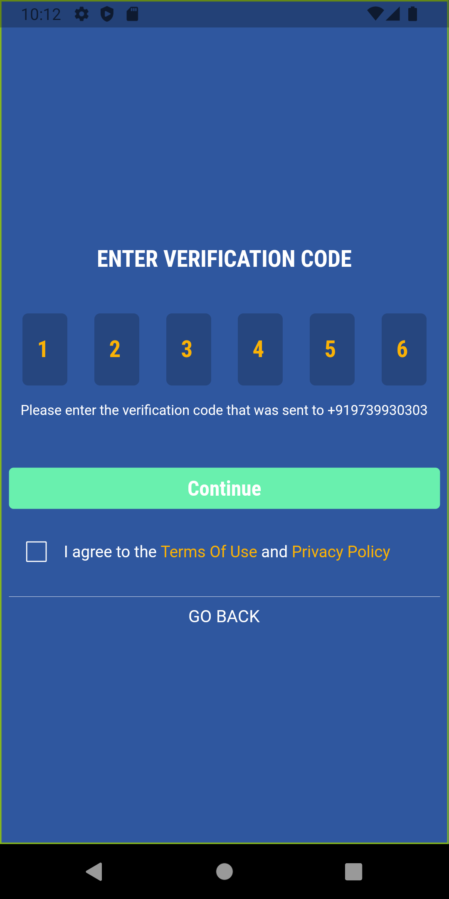
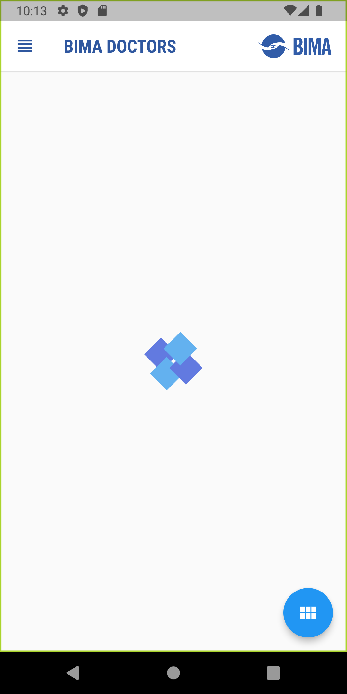
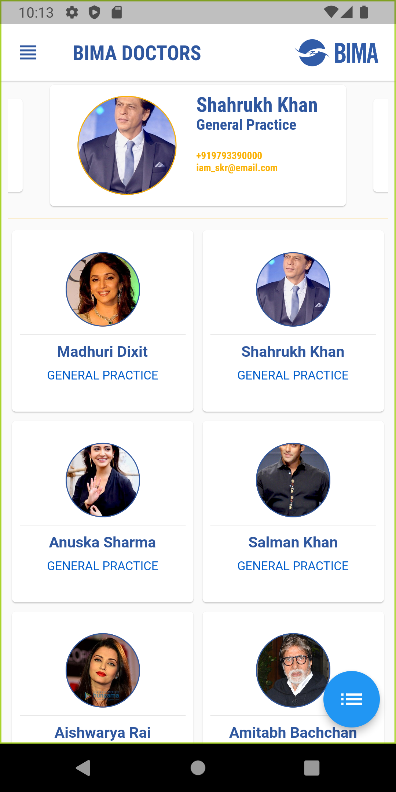
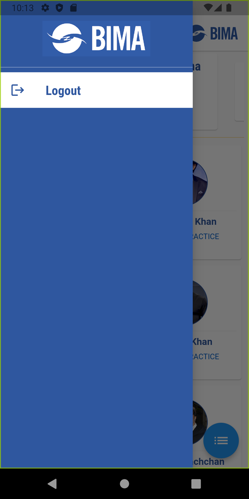
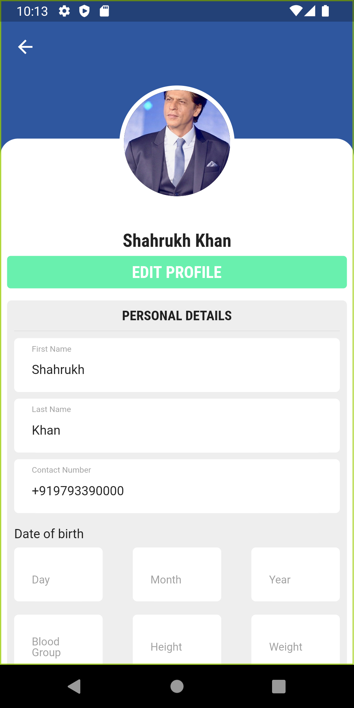
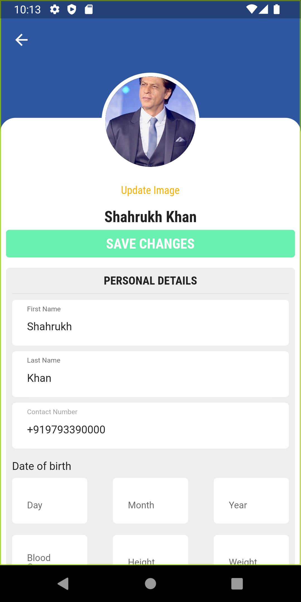
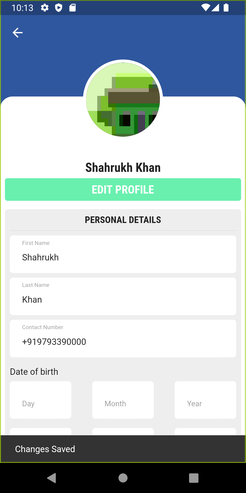

# DOCTOR PROFILE MANAGEMENT APPLICATION

A Flutter project listing using making API call and storing data locally using HIVE, also User Authentication using Firebase Auth 

---

## Features
- Local storage using Hive
- Firebase authentication
- OTP Verification
- Lottie animation
- Mobx state management
- Grid and List view

---
## Screenshots

 
 

 
 

 
 

 
 

 
 

---

